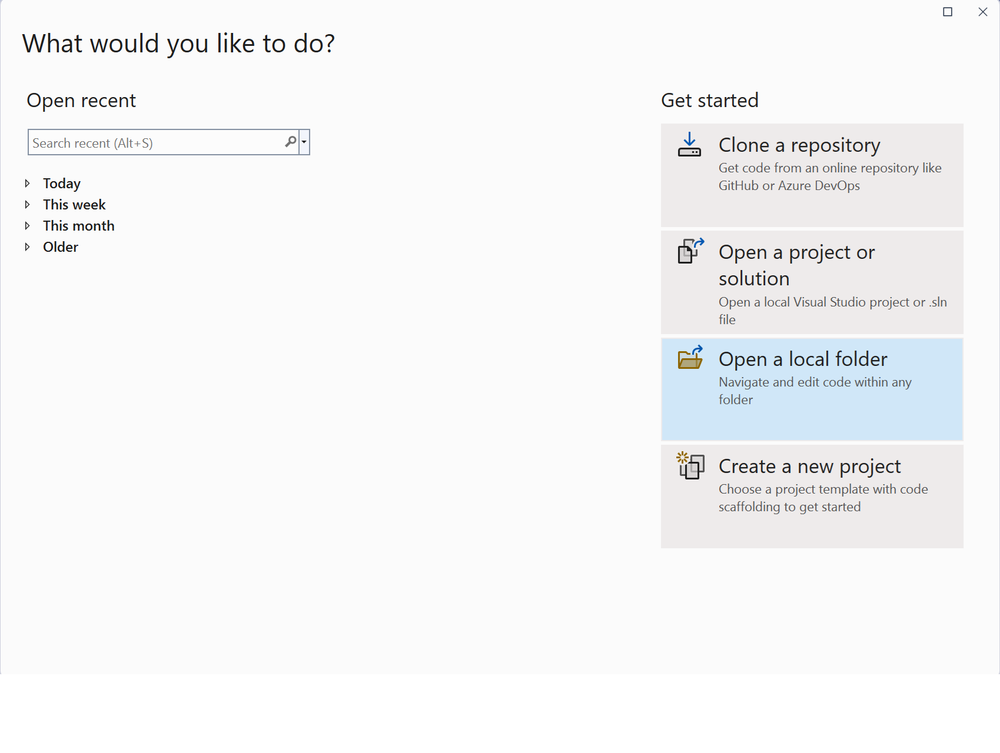
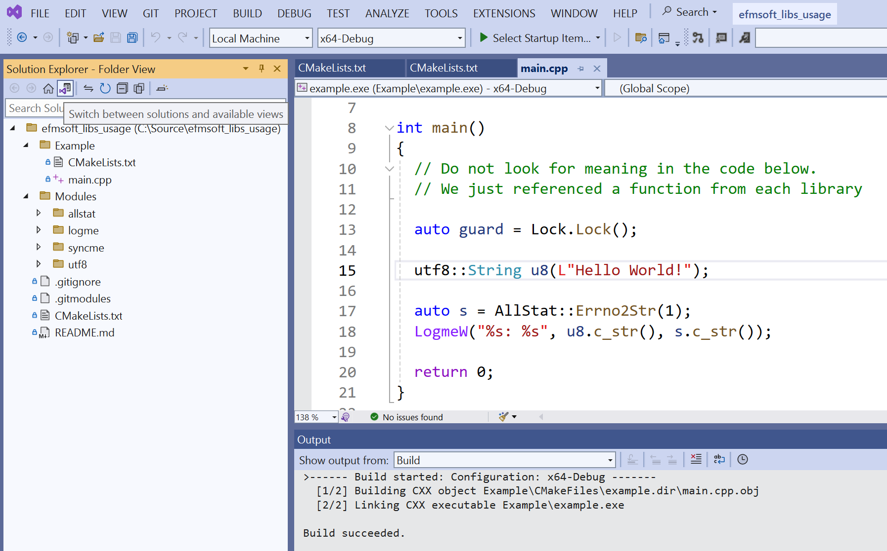
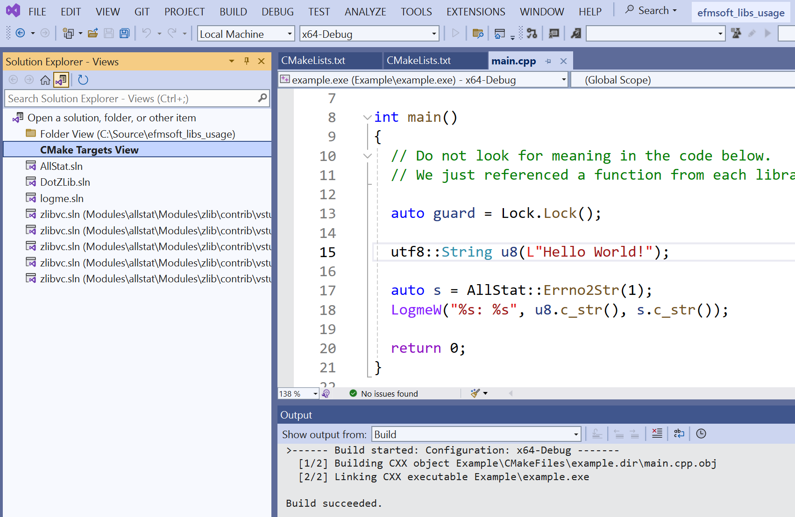
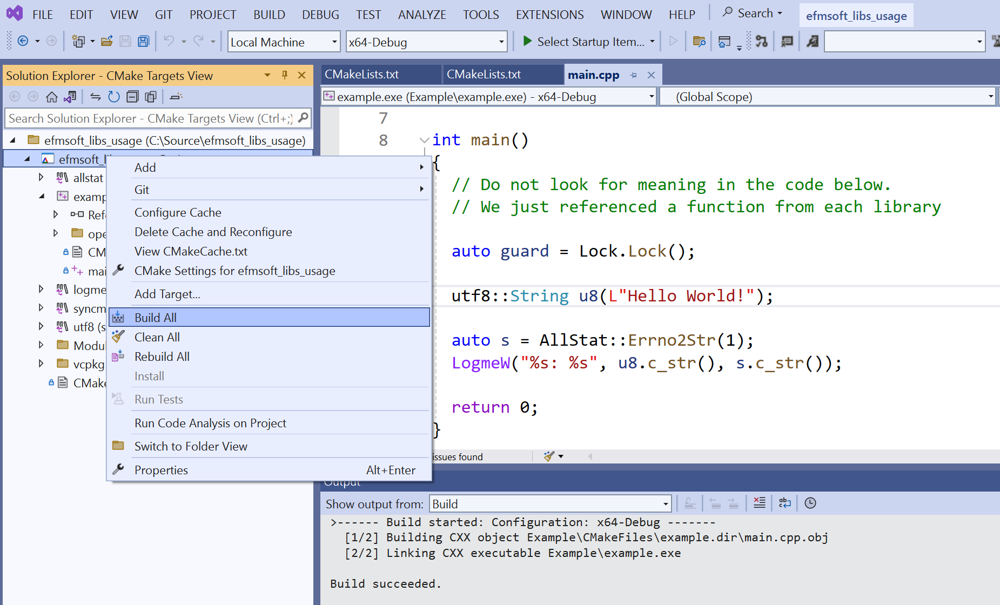

# efmsoft_libs_usage
Example of **cmake** project which uses **EfmSoft** libraries **logme**, **allstat**, **syncme** and **utf8**

Do not look for meaning in the **main**() code. We just referenced a function from each library. 

The idea of the project is to show how you can connect thease libraries to your project using **CMake**

You can use following commands to build this project on Linux/MacOS
```shell
git clone --recursive https://github.com/efmsoft/efmsoft_libs_usage.git
cd efmsoft_libs_usage
cmake .
make
```
On Windows you can use, for example, **Visual Studio** or **Visual Studio Code** to load the project. In case of **Visual Studio** just use Open Local Folder command and specify root folder of cloned source. Then switch to **CMake Targets View** and select **Build All**






